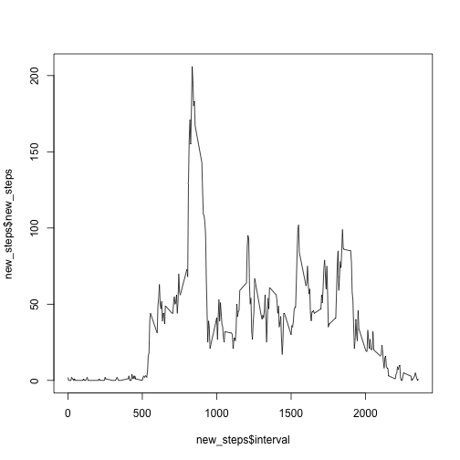
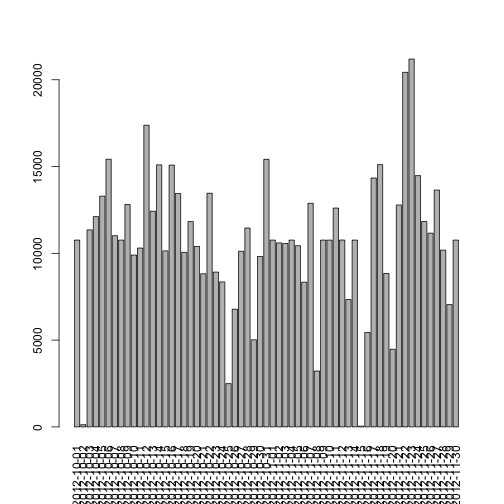
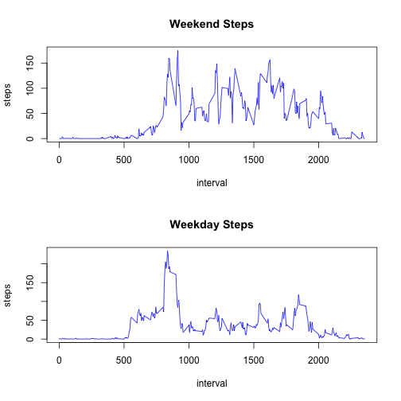

Reproducible Research - Assignment 1 Submission
========================================================
Doing this assignment required reading in a data set that was provided in the GitHub repository.  For the purposes of this write-up, it is assumed that the data set is in your current working directory.  Once this is true, you can read in this data.  Code contained here will also require the data.table package, so that must be initialized as well.


```r
base_data <- read.csv("activity.csv")
library(data.table)
```

What is mean total number of steps taken per day?
-------------------------------------------------

For this part of the assignment, you can ignore the missing values in the dataset.
<ol>
<li> Make a histogram of the total number of steps taken each day </li>
<li> Calculate and report the mean and median total number of steps taken per day</li>
</ol>


```r
##Topic 1 - What is mean total number of steps taken per day?
##Get the total number of steps per day, write results into a data frame and adjust columns as necessary
steps_per_day <- aggregate(base_data$steps,by=list(base_data$date),FUN="sum",na.rm=TRUE,na.action=NULL)
setnames(steps_per_day,"Group.1","date")
setnames(steps_per_day,"x","day_total")
##Answer questions 1 and 2 from topic 1 with barplot and mean/median
barplot(steps_per_day$day_total,names.arg=steps_per_day$date,las=3)
```

 

```r
mn_raw <- mean(steps_per_day$day_total)
mn_raw
```

```
## [1] 9354
```

```r
md_raw <- median(steps_per_day$day_total)
md_raw
```

```
## [1] 10395
```
What is the average daily activity pattern?
-------------------------------------------
<ol>
<li> Make a time series plot (i.e. type = "l") of the 5-minute interval (x-axis) and the average number of steps taken, averaged across all days (y-axis)</li>
<li> Which 5-minute interval, on average across all the days in the dataset, contains the maximum number of steps?</li>
</ol>

```r
##Topic 2 - What is the average daily activity pattern
##Get average number of steps by interval excluding NA, set names of columns to something that makes sense, round the mean
new_steps <- aggregate(base_data$steps,by=list(base_data$interval),FUN="mean",na.rm=TRUE,na.action=NULL)
setnames(new_steps,"Group.1","interval")
setnames(new_steps,"x","new_steps")
new_steps$new_steps <- round(new_steps$new_steps,0)
##Topic 2, Question 1 - plot daily activity pattern of average across all days
plot(new_steps$interval,new_steps$new_steps,type="l")
```

 

```r
##Topic 2, Question 2 - Which interval has maximum number of steps
new_steps[new_steps$new_steps==max(new_steps$new_steps),1]
```

```
## [1] 835
```
Imputing missing values
-----------------------
Note that there are a number of days/intervals where there are missing values (coded as NA). The presence of missing days may introduce bias into some calculations or summaries of the data.
<ol>
<li> Calculate and report the total number of missing values in the dataset (i.e. the total number of rows with NAs)</li>
<li> Devise a strategy for filling in all of the missing values in the dataset. The strategy does not need to be sophisticated. For example, you could use the mean/median for that day, or the mean for that 5-minute interval, etc.</li>
<li> Create a new dataset that is equal to the original dataset but with the missing data filled in.</li>
<li> Make a histogram of the total number of steps taken each day and Calculate and report the mean and median total number of steps taken per day. Do these values differ from the estimates from the first part of the assignment? What is the impact of imputing missing data on the estimates of the total daily number of steps?</li>


```r
##Topic 3 - Imputing missing values
##Topic 3, Question 1, 2 and 3
##merge table that has average steps by interval with base data
transform_data <- merge(base_data,new_steps,all=FALSE)
nrow(transform_data[is.na(transform_data$steps),])
```

```
## [1] 2304
```

```r
##create a new column that uses the mean value for that interval where the existing value is NA
transform_data$transform_steps <- ifelse(is.na(transform_data$steps),transform_data$new_steps,transform_data$steps)
##Topic 3, Question 4
##First aggregate the steps per day with missing values imputed and sum them, set names of columns
steps_per_day_transform <- aggregate(transform_data$transform_steps,by=list(transform_data$date),FUN="sum")
setnames(steps_per_day_transform,"Group.1","date")
setnames(steps_per_day_transform,"x","day_total")
##Create barplot and calculate mean/median same as topic 1
barplot(steps_per_day_transform$day_total,names.arg=steps_per_day_transform$date,las=3)
```

 

```r
mn_imp <- mean(steps_per_day_transform$day_total)
mn_imp
```

```
## [1] 10766
```

```r
md_imp <- median(steps_per_day_transform$day_total)
md_imp
```

```
## [1] 10762
```
These values are different from the estimates in the first part of the assignment.  We can see that imputing missing values has raised the average and median steps.

```r
mn_imp - mn_raw
```

```
## [1] 1411
```

```r
md_imp - md_raw
```

```
## [1] 367
```

Are there differences in activity patterns between weekdays and weekends?
--------------------------------------------------------------------------
For this part the weekdays() function may be of some help here. Use the dataset with the filled-in missing values for this part.
<ol>
<li> Create a new factor variable in the dataset with two levels -- "weekday" and "weekend" indicating whether a given date is a weekday or weekend day.</li>
<li> Make a panel plot containing a time series plot (i.e. type = "l") of the 5-minute interval (x-axis) and the average number of steps taken, averaged across all weekday days or weekend days (y-axis). </li>

```r
##Topic 4 - Are there differences in activity patterns between weekdays and weekends
##Topic 4, question 1
##Create new factor variable for day of week
transform_data$transform_dow <- weekdays(as.Date(transform_data$date))
##Create new variable that sets itself to 'weekend' when it's the weekend, otherwise weekday
transform_data$we <- ifelse(transform_data$transform_dow == "Saturday" | transform_data$transform_dow == "Sunday","weekend","weekday")
##Create dataframes that contain only weekend/weekday data
weekend_data <- transform_data[transform_data$we=="weekend",]
weekday_data <- transform_data[transform_data$we=="weekday",]
##Aggregate average weekend/weekday steps by interval
we_steps <- aggregate(weekend_data$steps,by=list(weekend_data$interval),FUN="mean",na.rm=TRUE,na.action=NULL)
wd_steps <- aggregate(weekday_data$steps,by=list(weekday_data$interval),FUN="mean",na.rm=TRUE,na.action=NULL)
setnames(we_steps,"Group.1","interval")
setnames(we_steps,"x","steps")
setnames(wd_steps,"Group.1","interval")
setnames(wd_steps,"x","steps")
##Create panel plot
par(mfcol=c(2,1))
with(we_steps, plot(interval, steps, type="l", col="blue",xlab="interval",ylab="steps",main="Weekend Steps",frame.plot=TRUE))
with(wd_steps, plot(interval, steps, type="l", col="blue",xlab="interval",ylab="steps",main="Weekday Steps",frame.plot=TRUE))
```

 


